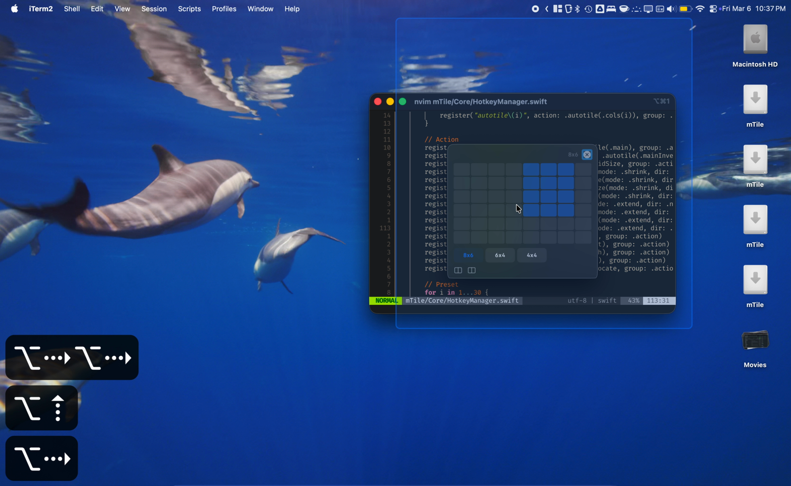

# mTile

A mostly vibecoded port of [gTile](https://github.com/gTile/gTile) to macOS. gTile is my favorite window tiler on Ubuntu/GNOME and I missed it on macOS, so here we are.

This brings the core grid-tiling workflow of gTile to macOS as a native Swift app.

[](https://raw.githubusercontent.com/protortyp/gTile-macos/develop/docs/demo.mp4)

<sub>Click the screenshot to open the short demo video (MP4).</sub>

## Features

- Grid overlay for tiling windows (Cmd+Option+G)
- Click or keyboard-driven grid selection
- Arrow keys to navigate, Enter to select, Shift+Arrow to expand selection
- Option+Arrow to shift the entire selection around
- Configurable grid sizes (e.g. 8x6, 6x4, 4x4)
- Window spacing and monitor insets
- Launch at login toggle in Settings
- Lives in your menu bar, stays out of the way

Current limitation:

- Shortcut recording/customization UI is not implemented yet (the Shortcuts tab is currently informational).

## Install

Grab the DMG from the [releases page](https://github.com/protortyp/gTile-macos/releases), or build it yourself:

```sh
./scripts/build-dmg.sh
```

You'll need to grant accessibility permissions when prompted.

To start mTile automatically on login:

- Open `mTile -> Settings -> General` and enable `Launch mTile at login`, or
- Use macOS `System Settings -> General -> Login Items`.

## Building from source

Requires Xcode and [XcodeGen](https://github.com/yonaskolb/XcodeGen).

```sh
brew install xcodegen
# also exists as nix package: https://search.nixos.org/packages?channel=25.11&query=xcode&show=xcodegen
xcodegen generate
open mTile.xcodeproj
```

## Credits

All credit for the original concept and design goes to the [gTile project](https://github.com/gTile/gTile) and its contributors.
